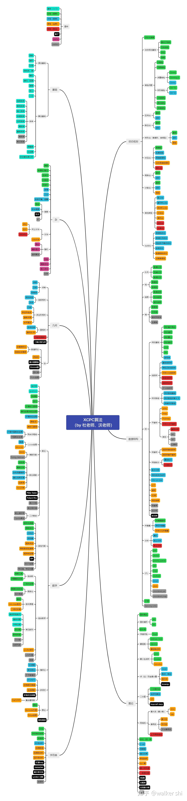

# 如何提升

> 你最后考试的分数，跟你复习数学期间用掉的草稿纸的厚度成正比！——杨超

杨超的这句话在任何地方都是适用的。没有捷径，唯有刷题。

## ACM 比赛考啥

算法竞赛一般全称程序设计竞赛，考察如何设计算法以解决题目，重点是解决问题的能力。

> 高中也有算法竞赛，[NOI 全国青少年信息学奥林匹克竞赛](https://www.noi.cn/)，五大竞赛之一，NOI 金牌可以获得清北的保送资格。很多高中参与过 OI 的学生大学会继续参加 ACM，因此差距会非常巨大，当你还为 `for/if` 等语法烦恼时，OIer 可能已经有 10 年代码经验了，刚入学便能够摘金夺银。但是也不必焦虑，只要努力，我们都有机会摘金夺银！

网上很少有总结 ACM 到底是啥，就一句写题。这里谈谈我的理解。

!!! warning "常见误区"
    很多不了解的人对算法竞赛有所误解，认为 ACM 类似知识竞赛，只要“博览”常见算法就能取得一个不错的成绩；也有人认为 ACM 只是对着一堆算法模版去照着敲，没多少创新，比的都是理解题目的能力。

    “会的算法多”不代表“竞赛能力强”。如果把算法比作轮子的话，算法比赛比的就是谁能拿轮子造出优秀的汽车。在刚学新算法时，题目要求你造的只是一辆独轮车，而比赛时选手需要造的有可能是一辆坦克。一味的增加轮子的种类数而不去训练造车的方法，是无法在比赛中拿到好成绩的。“算法竞赛”不是“算法数量大赛”。[^1]

    重点是做题方法与思考能力，也就是常说的思维，而不是知识清单。这类似无招胜有招的道理。

[^1]: 摘自 [您认为您最想告诉OI初学者的是什么？ - 扶苏的回答 - 知乎](https://www.zhihu.com/question/391533687/answer/1194659474)。

算法竞赛更倾向于“设计”与“创造”。简而言之，你需要创造算法，而不是使用算法。

算法竞赛有点研究的气质，可能与大家接触的工程相关画风很不一致。事实也确实如此，算法竞赛和学术界的联系比较紧密。

竞赛界目前远落后于学术界，经常有选手研读并引入的论文里的算法。但在部分问题上，竞赛界也有一些领先，OI 国家集训队每年都会出一本 [论文集](https://github.com/OI-wiki/libs/tree/master/集训队历年论文)，部分优秀论文可以发 [SOSA Paper](https://drops.dagstuhl.de/opus/volltexte/2018/10043/)。也有很多算法选手会往计算机的理论方向发展，如 TCS（[Theoretical computer science](https://en.wikipedia.org/wiki/Theoretical_computer_science)）和 PLT（[Programming language theory](https://en.wikipedia.org/wiki/Programming_language_theory)）。

## 入门

假如你还没有写完 150 题进入集训队，请先进入集训队。详细请看 [如何加入](../about/join-us.md)。

假如你是刚刚进队的萌新，你会发现个人赛对你来说很有难度。别急，大家大一也都是这么过来的。

先继续写 AtCoder Training 300 的中档题，和本 Wiki 基础章节的习题，写完就度过了入门期。

## 进阶

通常来说，算法竞赛很少通过书籍来学习，因为网上到处是公开的资料。假如确实想看书，我推荐 [《算法竞赛进阶指南》](https://book.douban.com/subject/30136932/)，我自己就是看这本入门的；如果你更喜欢听课，也可以试试 [代码源](https://appmhoxpcmq9368.h5.xiaoeknow.com/)、[AcWing](https://www.acwing.com/activity/)、[牛客](https://ac.nowcoder.com/acm/course)。

不论看书还是听课，学习知识点本身可能只占不到学习时间的 10%，更多的还是要刷题，刷题才能在实践中真正理解算法。

!!! warn "听课误区"
    听课会给人一种错觉，听了就等于学了，但这时候你只会做模板题，稍微增加一点变化就不会做了。到了真正比赛的时候，题目更加灵活多变，比赛结束才发现连最最基础的二分、DP 等算法都搞不明白。

    看似每天努力看视频，其实做的都是无用功。在后期也会遇到类似的问题，学了很多看起来高深的算法，其实根本就没有理解，比赛中遇到也写不出来。[算法竞赛不是算法数量大赛](../about/introduction.md#acm-比赛考啥)，学算法是比较容易的，给够大家时间都能学会，但是训练算法思维很困难。

训练思维最好还是参与 ATC（AtCoder） 和 CF（CodeForces） 的比赛。

CF 是俄罗斯 OJ，大概每两周都会举办比赛，每场都有接近 2 万人参加，会依据比赛名次给参赛者一个 Rating，这个 Rating 能比较好的反映实力。比赛等级按照难度由高到低是 Div 1、2、3、4，一般参加 Div 2，初学可以尝试 Div 3、4。

ATC 是日本 OJ，大概每两周都会举办比赛，也有 Rating。ATC 的题目比较有趣，题面简单。比赛难度由高到低为 AGC、ARC、ABC。

CF 的比赛大多在夜间 22 点开始（我相信大家没睡），时长 2 小时左右。ATC 的比赛大多在 20 点开始，时长 2 小时左右。如果对这些时间不满意，也可以自由选择时间 VP（虚拟参赛）以前的比赛。VP 会把你的名次插入当时的榜单中，有一种比赛的紧张感，是平时补题不具备的。

写题时也要注意舒适区，如砍瓜切菜一般切水题是很爽，但是你会发现啥也没学到。真在学习是很痛苦的，可能一天只写了 5、6 题甚至 1 题也很正常，你能感觉到自己在进步就行。

为鼓励大家参与 CF，CF 的 Rating 会以一定比例算入比赛积分。

## 深入

这个时候基本上大二了，算是真正接触了算法竞赛，知道自己该去学什么，这里提点其他的东西。

算法竞赛的知识太多，可以自己选择其中一个分支深入，不想学的丢给队友。

> **需要保证队伍整体没有短板，技能树完整，同时队伍的公共知识点也要尽可能多。**

很多时候题目恰好卡在一个人的盲区，很有可能需要队友的灵感，但这需要都学过该知识点。也不用学的太深，只要有讨论基础就行。

组队训练可以到往年的 ICPC/CCPC 区域赛中寻找真题，比如 [比赛资源 - HUST ACM](https://hustacm.com/%E6%AF%94%E8%B5%9B%E8%B5%84%E6%BA%90/#icpc)，也可以去 CF 的 Gym 里看看。有的时候需要一些难度更高的比赛，比如 PTZ（Petrozavodsk）、Open Cup、[UCup](https://ucup.ac/)。

CF 和 AT 也要多写一写，思维很重要。从以往的经验来说，三个人 CF 分数都有 1600，那么铜牌是有比较大的希望了。

## OJ 列表

一些比较常见的 OJ。

- [VJudge](https://vjudge.net/)，虚拟 OJ，可以直接提交其他 OJ 上的题目。
- [CodeForces](https://codeforces.com/)，俄罗斯 OJ，非常活跃，基本每周都有在线比赛（近期每场都有 2 万人），题目质量较高。其 Rating 能够比较好的反映实力，根据往年经验，三个蓝名（1600 分）有很大希望拿铜牌。
- [AtCoder](https://atcoder.jp/)，日本 OJ，非常活跃，基本每周都有在线比赛，题目新奇有趣，质量较高。其 Rating 也很有参考价值。
- [牛客](https://ac.nowcoder.com/acm/contest/vip-index)，国内 OJ，有很多国内高校的校赛，建议只参与比赛。
- [洛谷](https://www.luogu.com.cn/)，国内 OJ，题目很多，建议使用里面的题单功能。
- [HDOJ](https://acm.hdu.edu.cn/)，国内 OJ，题目很多，就是网站样式有点旧。建议网上寻找题单。

还有一些其他 OJ。

- [UOJ](https://uoj.ac/)，国内 OJ，题目质量极高，难度较大，学术氛围浓厚。
- [PTA](https://pintia.cn/)，国内 OJ。只建议天梯赛前看看。
- [力扣](https://leetcode.cn/)，国内 OJ，找工作用。对竞赛来说难度过低。
